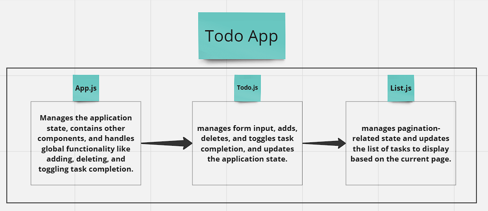

# Todo App:

---
**Done by laith rama and farah**

----

### Description

 > application follows a typical to-do list structure, for managing tasks with functionality for adding, deleting, and marking tasks as complete or incomplete. The List component handles the display of tasks and pagination. 

----

### UML

----

> **Global State:** the components access global state using the useContext hook, which is provided by the SettingsProvider component. This global state includes settings, the task list, and the count of incomplete tasks, all made available through the settingsContext.

> **useForm Hook:** Within the Todo component, the useForm hook simplifies form management. It offers handleChange for tracking input changes and handleSubmit for handling form submissions. These functions streamline input handling, such as adding new tasks to the list when the form is submitted, enhancing code clarity.

----

### snadbox-URL: 

----

### `npm start`

Runs the app in the development mode.\
Open [http://localhost:3000](http://localhost:3000) to view it in your browser.

The page will reload when you make changes.\
You may also see any lint errors in the console.

### `npm test`

Launches the test runner in the interactive watch mode.\
See the section about [running tests](https://facebook.github.io/create-react-app/docs/running-tests) for more information.

### `npm run build`

Builds the app for production to the `build` folder.\
It correctly bundles React in production mode and optimizes the build for the best performance.

The build is minified and the filenames include the hashes.\
Your app is ready to be deployed!

See the section about [deployment](https://facebook.github.io/create-react-app/docs/deployment) for more information.

